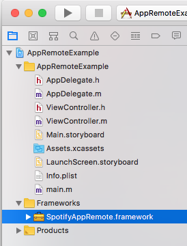
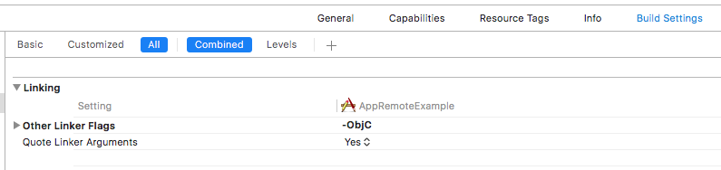

# Spotify App Remote SDK (iOS)

**Warning**: This is a beta release of the Spotify App Remote SDK (iOS).

The Spotify App Remote Framework allows your application to interact with the Spotify app running in the background on a user's device. Capabilities include getting metadata for the currently playing track and context as well as issuing playback commands.

**Please Note:** By using Spotify developer tools you accept our [Developer Terms of Use](https://beta.developer.spotify.com/terms/).


The Spotify App Remote is a set of lightweight objects that connect with the Spotify app and let you control it while all the heavy lifting of playback is offloaded to the Spotify app itself. The Spotify app takes care of playback, networking, offline caching and OS music integration, leaving you to focus on your user experience. Also, with the App Remote API, moving from your app to the Spotify app and vice versa is a streamlined experience where playback and metadata always stay in sync.

[Key Features](#key-features)

[Beta Release Information](#beta-release-information)

[Components](#components)

[How Do Remote Calls Work?](#how-do-remote-calls-work)

[Terms of Use](#terms-of-use)

[Tutorial](#tutorial)

## Key Features
* Playback is always in sync with Spotify app
* Playback, networking, and caching is all accounted for by the Spotify app
* Works offline and online and does not require Web API calls to get metadata for player state
* Automatically handles track relinking for different regions

## Beta Release Information
We're releasing this SDK early to gain feedback from the developer community about the future of
our iOS SDKs. Please file feedback about missing features or bugs over at our [issue tracker](https://github.com/spotify/ios-app-remote-sdk/issues).
Make sure you search existing issues before creating new ones.

[Open bug tickets](https://github.com/spotify/ios-app-remote-sdk/labels/bug) | [Open feature requests](https://github.com/spotify/ios-app-remote-sdk/labels/feature%20request)

## Requirements
The Spotify App Remote framework requires a deployment target of iOS 8 or higher. The
following architectures are supported: `armv7`, `armv7s` and `arm64` for devices,
`i386` and `x86_64` for the iOS Simulator.

# Components
## Models
* `SPTAppRemoteAlbum`
* `SPTAppRemoteArtist`
* `SPTAppRemoteLibraryState`
* `SPTAppRemotePlaybackRestrictions`
* `SPTAppRemotePlaybackOptions`
* `SPTAppRemotePlayerState`
* `SPTAppRemoteTrack`
* `SPTAppRemoteContentItem`
* `SPTAppRemoteUserCapabilities`
* `SPTAppRemoteImageRepresentable`

## SPTAppRemote
The main entry point to connect to the Spotify app and retrieve API components. Use this to establish, monitor, and terminate the connection.

## SPTAppRemotePlayerAPI
Send playback related commands such as:
* Play track by URI
* Resume/pause playback
* Skip forwards and backwards
* Seek to position
* Set shuffle on/off
* Request player state
* Request player context
* Subscribe to player state

## SPTAppRemoteImagesAPI
Fetch an image for a `SPTAppRemoteImageRepresentable`

## SPTAppRemoteUserAPI
Fetch/subscribe/set user-related data such as:
* Fetch and/or subscribe to `SPTAppRemoteUserCapabilities`
* Determine if a user can play songs on demand (Premium vs Free)
* Add/remove/check if a song is in a user's library

## SPTAppRemoteContentAPI
Fetch recommended content for the user.


# How do remote calls work?
When you interact with any of the API's you pass in a `SPTAppRemoteCallback` block that gets invoked with either the expected result item or an `NSError` if the operation failed. The block is triggered after the command was received by the Spotify app (or if the connection could not be made).

Here is an example using the `SPTRemotePlayerAPI` to skip a song:
```objective-c
[appRemote.playerAPI skipToNext:^(id  _Nullable result, NSError * _Nullable error) {
    if (error) {
        // Operation failed
    } else {
        // Operation succeeded
    }
}];
```

## Tutorial and Examples
We provide a Beginner's Tutorial to help you set up your build environment and get started with the iOS Framework. It leads you through the creation of a simple app that connects to the Spotify app, plays a track, and subscribes to player state. Within the download package you will also find a demo app with full source code to help get you started.

## Authentication and Authorization

To use Spotify App Remote your application will need to get a user's permission to control playback remotely first. This can be done in two ways:

1. By using Single Sign-On library. To do that you'll need to include the Spotify iOS SDK in your project and request `app-remote-control` scope. This approach is useful if you need to request more scopes or an access token for other purposes, for example to communicate with [Spotify Web API](https://beta.developer.spotify.com/documentation/web-api/).  Our [iOS SDK Tutorial](https://beta.developer.spotify.com/documentation/ios-sdk/quick-start/) provides instructions and examples.
2. Use built-in authorization mechanism in the App Remote Framework. To do that you'll need to request authorization view when connecting to Spotify. The library will automatically request the `app-remote-control` scope and show the auth view if user hasn't agreed to it yet. It's currently not possible to request additional scopes using this method. The Beginner's Tutorial contains an example on how to use this method.

# Terms of Use
Note that by using Spotify developer tools, you accept our [Developer Terms of Use](https://beta.developer.spotify.com/terms/).

### Included Open Source Libraries

* [MPMessagePack](https://github.com/gabriel/MPMessagePack)

# Tutorial
This tutorial leads you step-by-step through the creation of a simple app that uses the Spotify App Remote to play an audio track and subscribe to player state.

## Prepare Your Environment

Follow these steps to make sure you are prepared to start coding.


* Download the Spotify App Remote framework from the "Clone or download" button at the top of this page, and unzip it.
* Install the latest version of Spotify from the App Store onto the device you will be using for development. Run the Spotify app and login or sign up.
**Note:** A **Spotify Premium** account will be required to play a track on-demand for a uri.
* [Register Your Application](https://beta.developer.spotify.com/documentation/general/guides/app-settings/#register-your-app). You will need to register your application at [My Applications](https://beta.developer.spotify.com/dashboard/) and obtain a client ID. When you register your app you will also need to whitelist a redirect URI that the Spotify Accounts Service will use to callback to your app after authorization.

## Add Dependencies

1. Add the `SpotifyAppRemote.framework` to your Xcode project.



2. Add `-ObjC` to your project's "Other Linker Flags"  ([Technical Q&A QA1490](https://developer.apple.com/library/content/qa/qa1490/_index.html))\



3. In your info.plist add your redirect URI you registered at [My Applications](https://beta.developer.spotify.com/dashboard/). You will need to add your redirect URI under "URL types" and "URL Schemes". Be sure to set a unique "URL identifier" as well. [More info on URL Schemes](https://developer.apple.com/library/content/documentation/iPhone/Conceptual/iPhoneOSProgrammingGuide/Inter-AppCommunication/Inter-AppCommunication.html#//apple_ref/doc/uid/TP40007072-CH6-SW1)


4. Add `#import <SpotifyAppRemote/SpotifyAppRemote.h>` to your source files to import necessary headers.


## Authorize Your Application
To be able to use App Remote the user needs to authorize your application. If they haven't, the connection will fail with a `No token provided` error. To allow the user to authorize your app, you can use the Single Sign-On flow described in the [iOS SDK Tutorial](https://beta.developer.spotify.com/documentation/ios-sdk/quick-start/). This approach can be useful if your application needs a token with multiple scopes. If you're only interested in using App Remote you can use the built-in authorization flow.


### Using the built-in Authorization flow

1. Initialize `SPTAppRemoteConnectionParams` with your client ID and redirect URI.

```objective-c
SPTAppRemoteConnectionParams *params =
    [[SPTAppRemoteConnectionParams alloc] initWithClientIdentifier:@"your_client_id"
                                                       redirectURI:@"your_redirect_uri"
                                                              name:@"your_app_name"
                                                       accessToken:nil
                                                  defaultImageSize:CGSizeZero
                                                       imageFormat:SPTAppRemoteConnectionParamsImageFormatAny];
```

2. Initialize `SPTAppRemote` with your `SPTAppRemoteConnectionParams`

```objective-c
self.appRemote = [[SPTAppRemote alloc] initWithConnectionParameters:params
                                                           logLevel:SPTAppRemoteLogLevelDebug];
```

3. Initiate the authentication flow (for other ways to detect if Spotify is installed, as well as attributing installs, please see our [Content Linking Guide](https://beta.developer.spotify.com/documentation/general/guides/content-linking-guide/)).
```objective-c
// Note: A blank string will play the user's last song
BOOL spotifyInstalled = [self.appRemote authorizeAndPlayURI:@"spotify:track:69bp2EbF7Q2rqc5N3ylezZ"];
if (!spotifyInstalled) {
    /*
     * The Spotify app is not installed.
     * Use SKStoreProductViewController with [SPTAppRemote spotifyItunesItemIdentifier] to present the user
     * with a way to install the Spotify app.
     */
}
```

5. Configure your `AppDelegate` to parse out the accessToken in `application:openURL:options:` and set it on the `SPTAppRemote` connectionParameters

```objective-c
- (BOOL)application:(UIApplication *)app openURL:(NSURL *)url options:(NSDictionary<UIApplicationOpenURLOptionsKey,id> *)options
{
    NSDictionary *params = [self.appRemote authorizationParametersFromURL:url];
    NSString *token = params[SPTAppRemoteAccessTokenKey];
    if (token) {
        self.appRemote.connectionParameters.accessToken = token;
    } else if (params[SPTAppRemoteErrorDescriptionKey]) {
        NSLog(@"%@", params[SPTAppRemoteErrorDescriptionKey]);
    }
    return YES;
}
```

## Connect and Subscribe to Player State

1. Set your connection delegate and attempt to connect.

```objective-c
self.appRemote.delegate = self;
[self.appRemote connect];
```
```objective-c

- (void)appRemoteDidEstablishConnection:(SPTAppRemote *)appRemote
{
    // Connection was successful, you can begin issuing commands
}

- (void)appRemote:(SPTAppRemote *)appRemote didFailConnectionAttemptWithError:(NSError *)error
{
    // Connection failed
}

- (void)appRemote:(SPTAppRemote *)appRemote didDisconnectWithError:(nullable NSError *)error
{
    // Connection disconnected
}
```

2. Set a delegate and subscribe to player state:
```objective-c
appRemote.playerAPI.delegate = self;

[appRemote.playerAPI subscribeToPlayerState:^(id  _Nullable result, NSError * _Nullable error) {
    // Handle Errors
}];
```
```objective-c
- (void)playerStateDidChange:(id<SPTAppRemotePlayerState>)playerState
{
    NSLog(@"Track name: %@", playerState.track.name);
}
```
